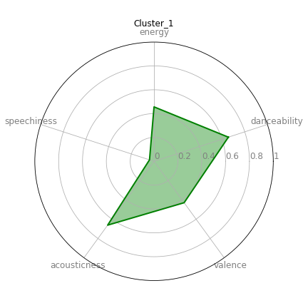
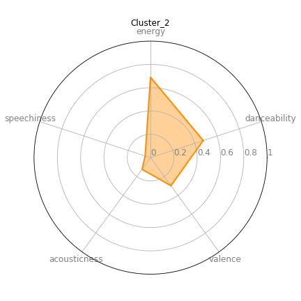
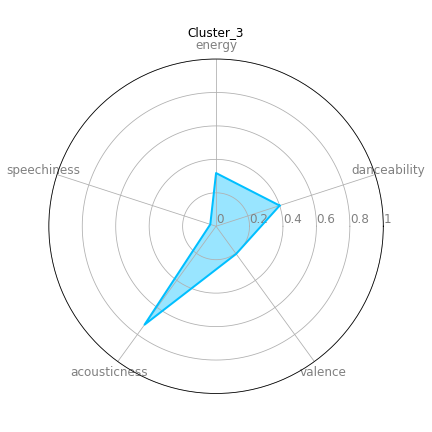
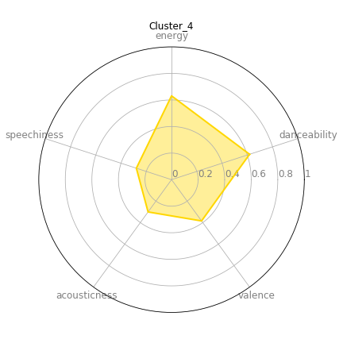

# Personal Spotify Playlist Clustering and Analysis

Clustering scraped Spotify songs and analysing the data by year and features. 

Clustered into 5 clusters; can be seen in "Clusters" folder. 

Visualised Clusters after decomposing into 3 principal components:

Cluster_0:

Cluster_1:

Cluster_2:

Cluster_3:

Cluster_4:

