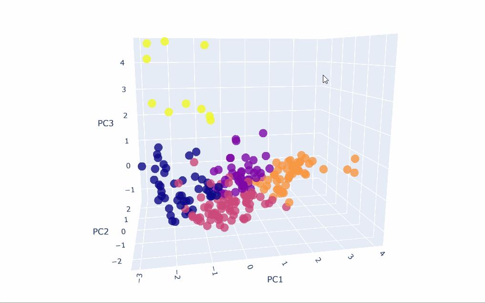
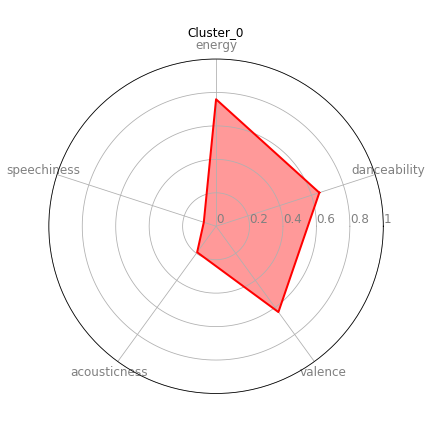

# Personal-Spotify-Playlist-Clustering-and-Analysis

Clustering scraped Spotify songs and analysing the data by year and features. 

Clustered into 5 clusters; can be seen in "Clusters" folder. 

Visualised Clusters after decomposing into 3 principal components:

e.g of cluster: (Cluster_0)

